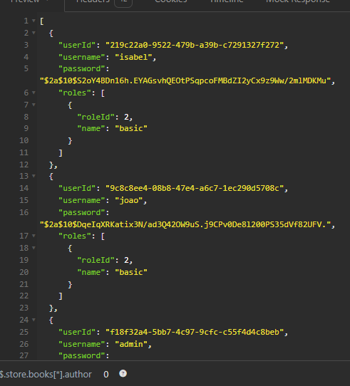

# API Mini Feed


API REST desenvolvida usando **Java, Java Spring, MySQL, Maven, Spring Security 6, OAuth2 Resource Server**

Esta API simula um Twitter simplificado com suas funcionalidades essenciais.

## Funcionalidades

Visualização de feed: Exibe o feed de tweets para os usuários autenticados.

Roles de acesso: Suporte a diferentes níveis de permissão com roles de "admin" e "usuário".

Autenticação e autorização: Implementação de mecanismos de segurança para garantir que apenas usuários autenticados possam acessar determinadas funcionalidades como ver feed, criar ou excluir seus próprios tweets.

Acesso total: A role "admin" possui a permissão de listar todos os usuários e deletar qualquer tweet.

## Instalação

Pré-requisito: Java 17

1. Clone o repositório:

```bash
git clone https://github.com/isinhah/mini-feed.git
```

2. Instale as dependências com Maven

3. Instale o [MySQL](https://www.mysql.com/)

## Execução

1. Inicie a aplicação com Maven no Terminal

```bash
mvn spring-boot:run
```

2. A API será acessível em http://localhost:8080

## Endpoints

A API possui os seguintes Endpoints:

```markdown
GET /feed - Retorna todas os tweets.

POST /tweets - Cria um novo tweet.

DELETE /tweets/{id} - Exclui um tweet pelo ID.

GET /users - Retorna todos os usuários.

POST /users - Cria um novo usuário.

POST /login - Realiza a autenticação do usuário.
```

## Feed


## Listagem de Usuários



## Autor

Isabel Henrique

https://www.linkedin.com/in/isabel-henrique/